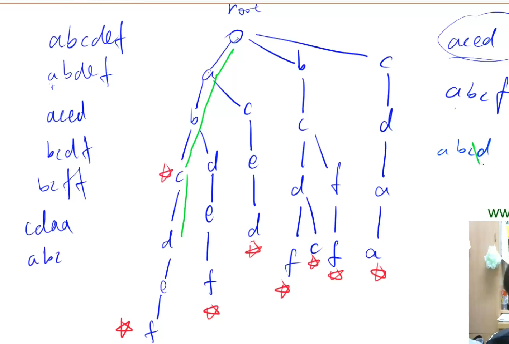

# AcWing 算法基础课 -- 数据结构

## AcWing 835. Trie字符串统计 

`难度：简单`

### 题目描述

维护一个字符串集合，支持两种操作：

1. “I x”向集合中插入一个字符串x；
2. “Q x”询问一个字符串在集合中出现了多少次。

共有N个操作，输入的字符串总长度不超过 $10^5$，字符串仅包含小写英文字母。

**输入格式**

第一行包含整数N，表示操作数。

接下来N行，每行包含一个操作指令，指令为”I x”或”Q x”中的一种。

**输出格式**

对于每个询问指令”Q x”，都要输出一个整数作为结果，表示x在集合中出现的次数。

每个结果占一行。

**数据范围**

$1 ≤ N ≤ 2 ∗ 10^4$

```r
输入样例：

5
I abc
Q abc
Q ab
I ab
Q ab

输出样例：

1
0
1

```

### Solution

1. 偷懒做法，用一个哈希表存储，做到时间复杂度为 O(n)。

```java
import java.util.*;
import java.io.*;

public class Main{
    public static void main(String[] args) throws IOException{
        BufferedReader br = new BufferedReader(new InputStreamReader(System.in));
        BufferedWriter bw = new BufferedWriter(new OutputStreamWriter(System.out));
        int n = Integer.parseInt(br.readLine());
        Map<String, Integer> map = new HashMap<>();
        String[] s;
        while(n > 0){
            n--;
            s = br.readLine().split(" ");
            if(s[0].equals("I")){
                map.put(s[1], map.getOrDefault(s[1], 0) + 1);
            }else{
                bw.write(map.getOrDefault(s[1], 0) + "\n");
            }
        }
        bw.close();
        br.close();
    }
}
```

2. 构造 Trie 树，Trie 树是**高效存储和查找字符串集合的数据结构**。

```java
import java.util.*;
import java.io.*;

public class Main{
    public static int N = 10010;
    // 记录当前是第几个结点
    public static int idx = 0;
    // 记录以当前结点为结尾的个数
    public static int[] cnt = new int[N];
    // 二维矩阵, N 为总字符串长度, 26 为每个结点最大可能有 26 个分支
    public static int[][] trie = new int[N][26];
    public static void main(String[] args) throws IOException{
        BufferedReader br = new BufferedReader(new InputStreamReader(System.in));
        BufferedWriter bw = new BufferedWriter(new OutputStreamWriter(System.out));
        int n = Integer.parseInt(br.readLine());
        String[] s;
        while(n-- > 0){
            s = br.readLine().split(" ");
            if(s[0].equals("I")){
                insert(s[1]);
            }else{
                int res = query(s[1]);
                bw.write(res + "\n");
            }
        }
        bw.close();
        br.close();
    }
    public static void insert(String s){
        // 每个字符串都从字典树的 0 级也就是 跟开始找
        int  p = 0;
        for(int i =0; i < s.length(); i++){
            int t = s.charAt(i) - 'a';
            // 如果这个 字母不存在,就新建一个结点,并且指向它
            if(trie[p][t] == 0) {
                // idx ++
                idx ++;
                trie[p][t] = idx;
            }
            // 更新结点序号
            p = trie[p][t];
        }
        // 更新以 idx 为结尾的字符串的个数
        cnt[p] ++;
    }
    public static int query(String s){
        int p = 0;
        for(int i = 0; i < s.length(); i++){
            int t = s.charAt(i) - 'a';
            if(trie[p][t] == 0) return 0;
            p = trie[p][t];
        }
        return cnt[p];
    }
}
```

### yxc

